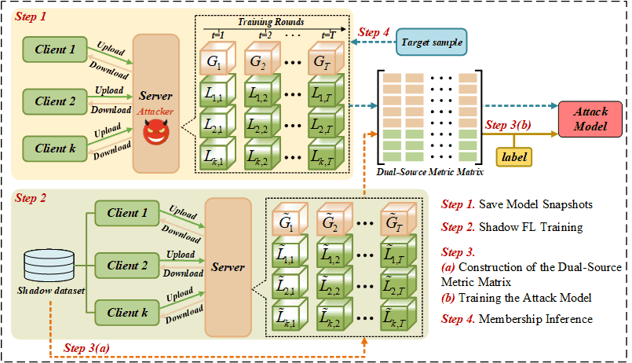

# Dual-Source Metric-Based Cross-Client Membership Inference Attack in Federated Learning

Official implementation of the paper:  
**"Dual-Source Metric-Based Cross-Client Membership Inference Attack in Federated Learning"**
---

## Main Content

- [Overview](#Overview)
- [Environment Setup](#Environment-Setup)
- [Project Structure](#Project-Structure)
- [Quick Start](#Quick-Start)

##  Overview

This repository provides the official implementation of **DSM-MIA**, a novel membership inference attack designed for **federated learning (FL)**.  
Unlike traditional MIAs that only determine whether a sample was used in training, DSM-MIA **identifies which specific client** in FL owns the sample.

<p align="center">
  
</p>

---

##  Environment Setup
Our code has been tested on Linux  with `Python 3.9.20`, `CUDA 12.1`, `PyTorch 2.0.1`.Before executing the project code, please prepare the Python environment according to the `requirements.txt` file. 

##  Project Structure
```bash
.
├── README.md
├── workflow.png
└── DS-MIA
    ├── experiments
    ├── models
    ├── utils
    ├── MetricSequence.py
    ├── Metrics.py
    ├── Models.py
    ├── attackMethodsFramework.py
    ├── dataset.py
    ├── main.py
    ├── mia_attack.py
    └── requirements.txt
```
## DataSet

For CIFAR100 anf CIFAR10 ,the source code will automatically download the required datasets in the subsequent steps, so there is no need to download them separately. 
For Dernemt you can download from [here](https://www.kaggle.com/datasets/shubhamgoel27/dermnet)

##  Quick Start(CIFAR100-ResNet18 for example)

### 1.Train the target federate learning model and save mode snapshot
```bash
python main.py --trainTargetModel Ture --num_users 5  --local_ep 5  --epochs 25  --model_name ResNet18 --dataset cifar100 --num_classes 100
```
### 2.Train the shadow federate learning model and save mode snapshot
```bash
python main.py --trainShadowModel Ture --num_users 5  --local_ep 5  --epochs 25  --model_name ResNet18 --dataset cifar100 --num_classes 100
```
### 3.Evaluate attacks

Once you have trained the targed and shaodw models and save the mode snapshot, you can evaluate the DS-MIA effectiveness using the following commands:
```bash
python mia_attack.py
```
##  Contact

If you have questions or issues, please open an issue or contact:
## your.email@domain.com

